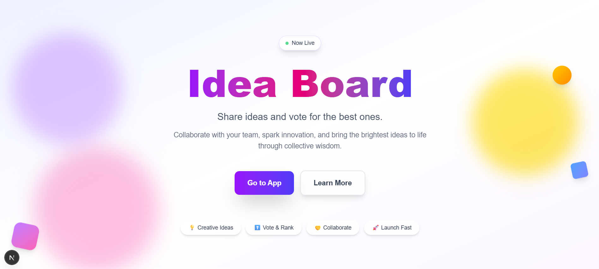
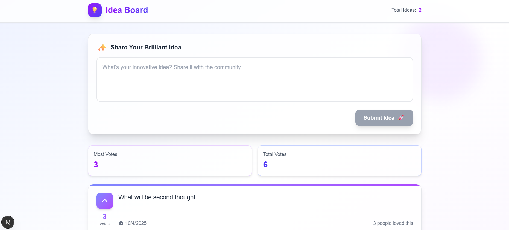

Idea Board 🌟
A full-stack web application that allows users to share and upvote innovative ideas in real-time. Built with Next.js, Node.js (Express), PostgreSQL, containerized using Docker, and deployable via Kubernetes.

## 📋 Table of Contents

->Project Overview
->Features
->Tech Stack
->Architecture
->Setup & Installation
-> Prerequisites
-> Clone the Repository
-> Frontend Setup
-> Backend Setup

->Docker & Docker Compose
->Kubernetes Deployment
->API Endpoints
->Folder Structure
->Environment Variables
->Screenshots
->Contributing
->License

## 🎯 Project Overview

The Idea Board project consists of two main components:

1. Landing Page
   A responsive marketing landing page featuring hero sections, feature highlights, and compelling call-to-action elements designed to engage users.

2. Idea Board Mini Web App

   -> Submit Ideas: Share innovative ideas (maximum 280 characters)
   -> Browse Ideas: Display all submitted ideas in an elegant card layout
   -> Upvote System: Interactive upvoting with real-time counter updates
   -> Persistent Storage: All data securely stored in PostgreSQL database

The application leverages modern frontend techniques with Tailwind CSS for a smooth user experience and visually appealing design.

## ✨ Features

📱 Fully responsive marketing landing page
✍️ Anonymous idea submission system
👍 Real-time upvote functionality with live counters
🎨 Animated, visually appealing interface with smooth transitions
💾 Persistent data storage using PostgreSQL
🐳 Containerized environment using Docker
☸️ Cloud-native deployment with Kubernetes support
🚀 Fast and optimized performance with Next.js
🔒 Secure API endpoints with input validation

## 🛠️ Tech Stack

**Frontend:** Next.js, React, Tailwind CSS  
**Backend:** Node.js, Express.js  
**Database:** PostgreSQL  
**Containerization:** Docker & Docker Compose  
**Orchestration:** Kubernetes (optional)

## 🏗️ Architecture

┌─────────────────┐         ┌─────────────────┐         ┌─────────────────┐
│                 │         │                 │         │                 │
│  Frontend       │ ◄─────► │  Backend        │ ◄─────► │  PostgreSQL     │
│  (Next.js)      │  REST   │  (Express.js)   │   SQL   │  Database       │
│  Port: 3000     │   API   │  Port: 4000     │         │  Port: 5432     │
│                 │         │                 │         │                 │
└─────────────────┘         └─────────────────┘         └─────────────────┘
        │                           │                           │
        └───────────────────────────┴───────────────────────────┘
                                    │
                        ┌───────────▼───────────┐
                        │  Docker Containers    │
                        │  & Kubernetes Pods    │
                        └───────────────────────┘

## Data Flow:

1. Frontend communicates with backend via RESTful 2.API endpoints
2. Backend processes requests and manages business logic
3. PostgreSQL stores and retrieves idea data persistently
4. Docker Compose orchestrates local development environment
5. Kubernetes manifests enable scalable cluster deployment

## 🚀 Setup & Installation

1. Prerequisites
   Ensure you have the following installed on your system:

Node.js >= 21.x
npm >= 9.x or yarn >= 1.22.x
Docker Desktop (latest version)
kubectl (optional, for Kubernetes deployment)
Git

2. Clone the Repository
   bashgit clone https://github.com/ShivamRathor13/The-Idea-Board.git
   cd The-Idea-Board

--> Frontend Setup
bash# Navigate to frontend directory
cd frontend-app

# Install dependencies

npm install

# Start development server

npm run dev
The frontend will be availabl....e at http://localhost:3000
Available S/cripts:

npm run dev - Start development server
npm run build - Build for production
npm start - Start production server
npm run lint - Run ESLint

> **Note:** Sometime Script may have an issue so direct can use npx next dev

--> Backend Setup
bash# Navigate to backend directory
cd backend

# Install dependencies

npm install

# Start the server

npm start
The backend API will be available at http://localhost:4000
Available Scripts:

npm start - Start production server

> **Note:** Sometime Script may have an issue so direct can use node server.js

## 🐳 Docker & Docker Compose

Build and Start Containers
bash# From project root directory
docker-compose up --build
Services:

Frontend: http://localhost:3000
Backend: http://localhost:4000
PostgreSQL: port 5432

Stop Containers
bashdocker-compose down
Remove Volumes (Clean Database)
bashdocker-compose down -v
View Logs
bash# All services
docker-compose logs -f

# Specific service

docker-compose logs -f backend

☸️ Kubernetes Deployment
Ensure Docker images are built and pushed to a container registry before deploying to Kubernetes.
Deploy to Cluster

navigate to Kubernates directory
bash# Apply all manifests
kubectl apply -f .

# Or apply individually

kubectl apply -f kubernetes/db.yaml
kubectl apply -f kubernetes/backend.yaml
kubectl apply -f kubernetes/frontend.yaml
Check Deployment Status
bash# Check all pods
kubectl get pods

# Check services

kubectl get services

# Check deployments

kubectl get deployments
View Logs
bash# Get logs from a specific pod
kubectl logs <pod-name>

# Follow logs

kubectl logs -f <pod-name>
Delete Resources
bash# Delete specific pod
kubectl delete pod <pod-name>

# Delete all resources

kubectl delete -f kubernetes/

## 📡 API Endpoints

Base URL: http://localhost:4000/api

| Method | Endpoint            | Description     |
| ------ | ------------------- | --------------- |
| GET    | `/ideas`            | Fetch all ideas |
| POST   | `/ideas`            | Add a new idea  |
| POST   | `/ideas/:id/upvote` | Upvote an idea  |

## 📁 Folder Structure

The-Idea-Board/
│
├── frontend-app/
│ ├── pages/
│ │ ├── index.jsx # Landing page
│ │ ├── app.jsx # Idea Board application
| | | globals.css # Global styles with Tailwind
│ │ └── \_app.jsx # Next.js app wrapper
│ ├── components/
│ │ ├── Header.jsx # Navigation header
│ │ ├── IdeaCard.jsx # Individual idea card
│ │ ├── IdeaForm.jsx # Idea submission form
│ │ └── Footer.jsx # Page footer
│ ├── hooks/
│ │ └── useIdeas.js # Custom hook for idea management
│ ├── services/
│ │ └── ideaServices.js # API service layer
│ ├── public/ # Static assets
│ ├── package.json
│ ├── Dockerfile
│ └── next.config.js
│
├── backend/
│ ├── controllers/
│ │ └── ideaController.js # Business logic for ideas
│ ├── models/
│ │ └── ideaModel.js # Database models
│ ├── routes/
│ │ └── ideaRoutes.js # Express routes
│ ├── middleware/
│ │ └── errorHandler.js # Error handling middleware
│ ├── config/
│ │ └── database.js # Database configuration
│ ├── server.js # Express server entry point
│ ├── package.json
│ └── Dockerfile
│
├── kubernetes/
│ ├── backend.yaml # Backend deployment & service
│ ├── frontend.yaml # Frontend deployment & service
│ ├── db.yaml # PostgreSQL deployment & service
│ └── configmap.yaml # Configuration management
│
├── docker-compose.yml # Docker Compose configuration
├── .gitignore
├── README.md
└── LICENSE

## 🔐 Environment Variables

Frontend (frontend-app/.env.local)
envNEXT_PUBLIC_API_URL=http://localhost:4000/api
envPORT=4000
DB_HOST=localhost
DB_PORT=5432
DB_NAME=ideaboard
DB_USER=postgres
DB_PASSWORD=yourpassword
NODE_ENV=development

📸 Screenshots

# HomePage

# Idea Submit Page

## 🤝 Contributing

Contributions are welcome! Please follow these steps:

Fork the repository
Create a new branch (git checkout -b feature/amazing-feature)
Make your changes
Commit your changes (git commit -m 'Add some amazing feature')
Push to the branch (git push origin feature/amazing-feature)
Open a Pull Request

Please ensure your code follows the project's coding standards and includes appropriate tests.

## 📄 License

This project is licensed under the MIT License - see the LICENSE file for details.

## 👨‍💻 Author

Shivam Rathor

GitHub: [@your-username](https://github.com/ShivamRathor13/)
LinkedIn: [Your Profile](https://www.linkedin.com/in/shivam-rathor-130198shivam/)

## 🙏 Acknowledgments

Next.js team for the amazing framework
Express.js community
PostgreSQL contributors
All open-source contributors

Made with ❤️ and ☕
